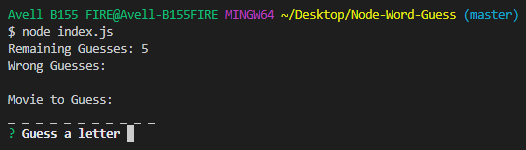
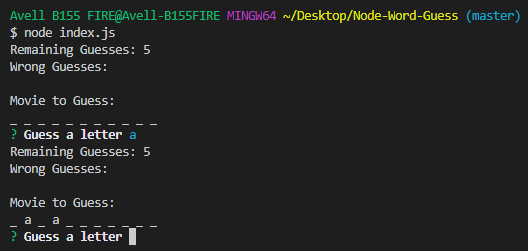
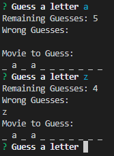
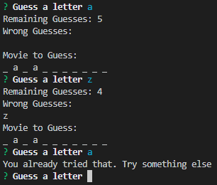
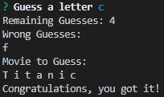
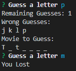

# Node-Word-Guess
### The classic is back, now in the terminal
#
## Getting Started
On the console, type 'npm install' and press enter\
That's all
#
## How to play
On the console, type 'node index.js' and press enter\
You will get some basic information and be asked to guess a letter\
It is not case sensitive. If you don't know what that means just don't worry about it\
As simple as ever
#

#
If you guess right, it will update the word
#

#
If you guess wrong
- You lose a chance (spoiler alert: when you get to 0, you lose the game)
- 'Wrong Guesses' is updated (so you don't forget what you have already tried)
- The word stays the same
#

#
If you try something that you have already tried before nothing will happen and you will be asked to try again
#

#
If you guess all the letters before you run out of guesses you win
#

#
If you run out of guesses you lose. Losers don't get updated information, they just lose\
I warned you
#

#